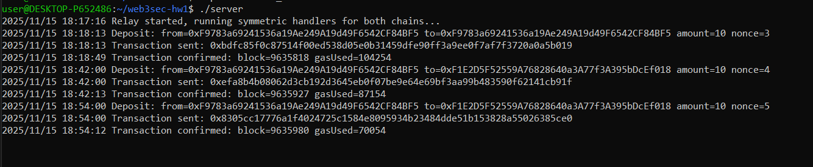

Обязательное задание выполнено полностью. Дополнительное задание не выполнено.

## Информация, требуемая в задании

### Архитектруа моста
* `src/BrigdeToken.sol` - токен
* `src/Brigde.sol` - мост
* Токен позволяет выполнять `mint` только пользователям с ролью `MINTER_ROLE`
* Токен позволяет выполнять `burn` только пользователям с ролью `BURNER_ROLE`
* Любое обращение к мосту должно содержать идентификатор идемпотентности запроса (`nonce`), которое должно быть уникальным (проверка производится перед выполнением запроса)
* При вызове создания депозита (`deposit`) мост переводит себе токены и сжигает их, а затем создаёт событие с необходимой информацией
* Сервер получает событие из вызывает `receiveFromOtherChain` у моста из другой сети
* `receiveFromOtherChain` проверяет `nonce` и выполняет начисление токенов

### Адреса
* Контракт А: 0x289A09F3d30c5cE1F6877F2c8F8B76f6EE60654d
* Контракт B: 0x15E183260d98862805507ECe3E035b4da96A3c35
* Мост А: 0xA7f2db6756feb28890Ad7a68f4F29bE35E7C6161
* Мост B: 0xcE9603F46283882C3d46d691Cb5Fe596C240665d
* Адрес списения (производилось в контракте А): 0xF9783a69241536a19Ae249A19d49F6542CF84BF5
* Адрес начисления (производилось в контракте B): 0xF1E2D5F52559A76828640a3A77f3A395bDcEf018
* Всё производилось в одной сети: https://eth-sepolia.g.alchemy.com/v2/4c7oM8fvGkrWzaALw1naJ
* Переводилось 100*10^-18 eth

### Логгирование событий сервером

## Дополнительная информация

### Деполой токенов и мостов

* `script/DeployA.s.sol` - для токена А и его моста. Выдаёт адреса созданных токена и моста.
* `script/DeployB.s.sol` - для токена B и его моста. Выдаёт адреса созданных токена и моста.

### Сборка сервера

* Сервер реализован на ЯП Go
* Код: `server.go`
* Установка go на Linux: `sudo snap install go --classic`
* Сборка: `go build`

### Запуск сервера

* Должны быть установлены следующие переменные окружения:
    * `BRIDGE_A_ADDRESS` - адрес моста А
    * `BRIDGE_B_ADDRESS` - адрес моста B
    * `PRIVATE_KEY` - приватный ключ, от которого выполняются операции
* `./server`

### Другие скрипты

* `script/CheckBalance.s.sol` - проверка баланса по следующим переменным окружения:
    * `TOKEN_ADDRESS` - адрес токена, в котором проверяется баланс
    * `ACCOUNT` - аккаунт для которого проверяется баланс
* `script/MintTokens.s.sol` - пополнение баланса по следующим переменным окружения:
    * `TOKEN_ADDRESS` - адрес токена в котором производится пополнение баланса
    * `RECIPIENT` - адрес пользователя, которому пополняется баланс
    * `AMOUNT` - сумма пополнения баланса (10^-18 eth)
* `script/TestDeposit.s.sol` - выполнение запуска флоу с переносом токенов в другую сеть по следующим переменным окружения:
    * `TOKEN_ADDRESS` - адрес токена, из которого производится списание
    * `TO_ADDRESS` - адрес пользователя, которому надо выполнить перевод
    * `BRIDGE_ADDRESS` - адрес моста, через который производится списание
    * `TARGET_CHAIN_ID` - сеть, в которую пересылаются токены
    * `NONCE` - идентификатор идемпотентности запроса
    * `AMOUNT` - сумма (10^-18 eth)

### Деплой в локальной сети

Выполнен при помощи `anvil`:
* `anvil --port 8545 --chain-id 1337`
* `anvil --port 8546 --chain-id 1338`
* Взять адрес и приватный ключ из выведенных `anvil`
* Далее вызов скриптов выполняется в формате `forge script <путь до скрипта> --rpc-url <соответствующая сеть> --broadcast --private-key <ключ пользователя, от которого выполняется скрипт>`
* Деплой токенов и мостов как указано выше
* Запуск сервера как указано выше
* Пополнение баланса как указано выше
* Выполнение запуска флоу с переносом токенов в другую сеть как указано выше
* Проверка баланса как указано выше